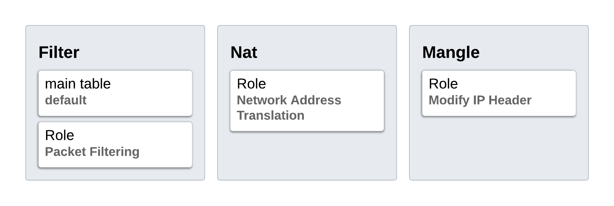
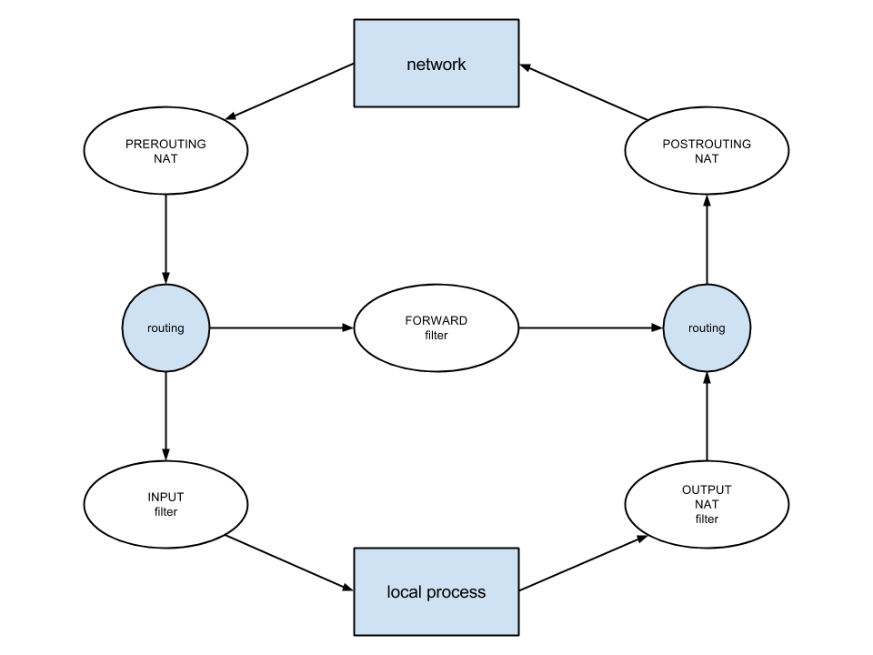
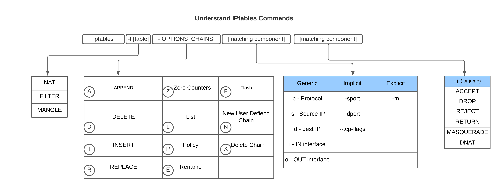

<!-- @format -->

## what is iptables?

### iptables is a user-space utility program that allows a system administrator to configure the IP packet filter rules of the Linux kernel firewall, implemented as different Netfilter modules. The filters are organized in different tables, which contain chains of rules for how to treat network traffic packets.

### which is used to create and quick powerful firewall for your system. IPtable provide an interface to work packet filtering framework off Linux kernel called net filter. in very simple term it is a powerful tool to manage networks packets coming to and going out of your system. so with IP table you can block or accept or take other action on the network traffic based on deferent user-defined condition

## understand the concept of ip table first

### There are currently three independent tables (which tables are present at any time depends on the kernel configuration options and which modules are present).

## understand of three term in iptables

### Tables

- ### ip table is consist of five tables out of three is main tables and each table has different rules
  - ### filter table
    - ### first is the filter table now this is the main and default table used in iptables which means whenever you don't mention any specific table the rule applied filter table. as the name suggests the role of this table is of filtering packet that is to make a decision about whether to let a packet continue to its intended destination or to deny destination request
  - ### nat table
    - ### The second is the NAT table as the name suggests this table used to provide network address translation rules now the rules in this table will determine whether to modify and how to modify the packet source or destination addresses in order to route the packet in NAT setup
  - ### mangle table
    - ### The second is the mangle table now this table is used to alter the IP headers of the packet for instance you can adjust the time to live detail value of the packet either lengthening or shortening the number of valid network hops that the packet can sustain now other IP header can be altered in a similar way
  - ## IP Tables 

### Chains

- ### chains are the like points in the route of a packet where you can apply rules there are five chains in IP tables
  - ### INPUT
    - ### this chain is used to filter the incoming packets. input chain is a post prerouting when packet inter in system it will be **\*filter** by this chain
  - ### OUTPUT
    - ### output chain is applied to the packet originated from your system and going out
  - ### FORWARD
    - ### forward chain is applied to a packet that is forwarded through your system and it is used to **\*filter** the packets that are forwarded through the system.
  - ### PREROUTING
    - #### before taking any routing decisions have been made regarding where to send the packet
  - ### POSTROUTING
    - ### postrouting is opposite of prerouting this is applied to odd going or forwarded traffic after routing decision has taken place and just before packet is being put on the wire and sent out
- ### all chain are not available for all tables each chain gives you option to take action on the packet at that particular point in the packet route
- ## Chain-Traversal 

### Rules

- ### rules are nothing but user-defined commands to manipulate the network traffic now as each chain is called the packet will be cheked against each rule within the chain in order if the packet dose not math the next rule in the chain is examned if it dose match then next rule is specified by the value of target now eatch rule has basically two component **\*mathcing** component and **target** component
  - ### Matching Component
    - ### Matching component is the part of the rule that is used to match the packet against the rule.
    - ### matching component is different condition available to define rules you can match by **\*protocol** type destination or **\*source address** destination or source port input or output interface header etc now can be combined to create really complex rule sets
  - ### Target Component
    - ### Target component is the part of the rule that is used to specify what action to take when the packet matches the rule.
    - ### target component is the action that are triggered when a packet meets the matching criteria of a rule and there are two types of target. **\*Terminating Targets**, **\*Non-Terminating Targets**
  - ### Terminating Targets
    - ### terminating target are basically actions that end the further traversal in that particular chain some example of terminating targets
      - Accept
      - Drop
      - Queue
      - Return
      - User-Defined
  - ### Non-Terminating Targets
    - ### **_MARK, LOG_** and many others are non-terminating targets.

## Let's do some practical

## understand iptables commands

    iptables -t [table] - OPTIONS [CHAINS] [matching component] [action component]

### get list of iptables

    iptables -L -n -v

### get list of iptable of specific iptables

    iptables -t nat -L -n -v

### get list of iptable of specific iptables and line number

    iptables -t nat -L -n -v --line-numbers

### block website from your local network

    sudo iptables -A INPUT -s cleverange.com -j DROP
    sudo iptables -A INPUT -s 10.0.1.0/24 -j DROP
    sudo iptables -A INPUT -s 10.0.1.50 -j DROP

### delete block network from iptables

    sudo iptables -D INPUT 1

### block all network from iptables

    sudo iptables -P INPUT DROP

### unblock all network from iptables

    sudo iptables -P INPUT ACCEPT

### block specific port

    sudo iptables -I INPUT -p tcp --dport 80 -j DROP

### block specific port with my ip address

    sudo iptables -I INPUT -p tcp --dport 80 -s 37.111.231.86 -j ACCEPT

### save the iptables configuration

      sudo iptables-save > /etc/iptables/rules.v4
      sudo /sbin/iptables-save > /etc/iptables/rules.v4

### flush all rules in iptables configuration

      sudo iptables -F

### Reference:

- ### [linux.die.net](https://linux.die.net/man/8/iptables)
